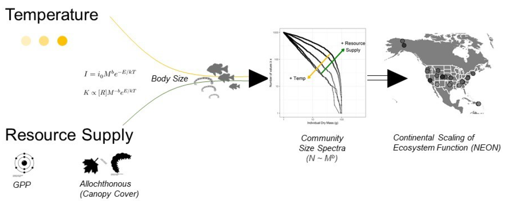
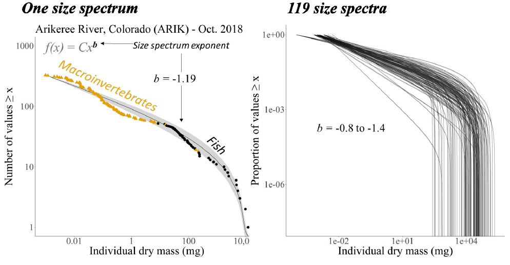

```{r global options, include = TRUE, echo = FALSE, warning=FALSE, message=FALSE}
here::i_am("docs/2022_YR1_annual-report/2022_YR1_annual-report.Rmd")
knitr::opts_chunk$set(echo=FALSE, warning=FALSE, message=FALSE)#,fig.path='./docs/2022_YR1_annual-report/figures/')
library(png)
library(tidyverse)
```

### Accomplishments

#### What are the major goals of this project?

The main goal of this project is to discern the role of temperature and resource supply on energy transfer through stream food webs of the National Ecological Observation Network (NEON). There is a common pattern across ecosystems in which organism abundance (*N*) declines with increasing body mass (*M*). The shape of this relationship is described by a power law, $N ~ M^b$, known as the abundance size-spectrum and the exponent, *b*, varies in relation to changes in energy flow through food webs and ecosystems. Warming temperatures are expected to alter ecosystem size-spectra, yet, experimental and observational research has shown varied effects (e.g., positive, negative, and neutral). Further, the transfer of energy from basal resources to higher trophic levels may also be influenced by the amount of resources available, as this sets the limits on the biomass an ecosystem can potentially support. Therefore, the proposed work will quantify the natural variation in the size-spectra of streams across broad geographical areas represented by NEON sites and test the hypothesis that *b* scales with temperature and resource supply (Figure 1).



We will accomplish this goal through a number of objectives. We will:

1) **Characterize the relationship between abundance and body size, $N ~ M^b$, in the macroinvertebrate and fish communities of NEON streams**

We will develop standardized protocols and methods to characterize spatiotemporal variability in NEON stream community size-spectra. The size-spectra literature is composed of varied methods for calculating *b* from community data--up to 16 different types of size spectra. These include multiple binning methods, pre-analysis normalization, biomass spectra, etc. and there exists no straightforward transformation among methods. This variation in methodologies hinders the ability for synthesis and drawing broader conclusions from the existing literature. In this project, we will estimate *b* using a standardized approach employing maximum likelihood estimation, a method that does not require binning thereby providing an unbiased estimate of *b*.

Additionally, underlying the uncertainty in how size spectra relate to temperature and resource supply is an incomplete characterization of the natural variation in size spectra over space and time. Due to the large logistical efforts needed to collect, identify, count, and measure 1000's or 10000's of individuals for a single size spectrum, studies are limited to a small number of replicates and typically a single sample per site. We will leverage the sampling infrastructure of NEON, which conducts multiple sampling campaigns at each site annually, to better characterize the background variation in size spectra. We will analyze the biological data from these campaigns using a standardized approach. Further, we will develop an open-source package in the R statistical computing environment to help other researchers to estimate *b* using our standardized approach, reducing the barriers for future syntheses.

2) **Characterize the temperature regimes of NEON streams**

We will develop statistical frameworks to characterize and summarize the temperature regimes of NEON streams. The water temperature data across NEON streams varies in length of record and completeness. We will develop workflows which allow us to characterize the water temperature regimes annually and account for missing values by integrating air temperature record. From these, we will be able to explore the influence of different aspects of NEON streams' thermal regimes (e.g., annual mean, seasonal variability, temperature anomolies, etc.) on the body size--abundance scaling in food webs.

3) **Quantifying resource availability in NEON streams**

We will quantify the supply of basal resources to consumers across NEON stream ecosystems. Basal resource supply provides the energetic base which feeds higher trophic levels and therefore sets limits on the biomass and trophic levels ecosystems can support. In addition to the macroinvertebrate and fish sampling, NEON also maintains routine sampling of other ecological variables and network of sensors allowing for the quantification of both autochthonous and allochthonous basal resources availability. To quantify autochthonous resources we will take advantage of the sensor network's data streams of continuous dissolved oxygen, stream stage, discharge, and temperature to estimate ecosystem metabolism. To quantify allochthonous resources, we will build a metric of allochthonous inputs that takes into account canopy cover as a proxy for terrestrial inputs. Together, gross primary production and terrestrial inputs make up the total energetic base fueling production and the maintenance of biomass from primary to tertiary consumers.

#### What was accomplished under these goals (you must provide information for at least one of the 4 categories below)?

##### Major activities:

Through the past year we have made strides towards all three stated objectives. We anticipate further refinements to be accomplished over the following year, as well as, substantive progress addressing the quantification of resource availability among NEON streams.

We have developed the workflow and statistical framework to combined the NEON macroinvertebrate and fish assemblage data in comparable units, allowing us to develop multi-trophic size spectra in all streams (Figure 2). This procedure is updated upon new data releases by NEON (approximately semi-annually). 



We have also developed models to impute missing stream temperature data using adjacent air temperature sensor data. These models allow us to fill data gaps and incorporate model uncertainty into final analyses.

```{r fig3, fig.align='center', dpi = 450, fig.cap = "Figure 3. Annual water temperature regimes across all streams. Temperatures are modeled and gap filled from generalized additive models from adjacent air temperature monitoring stations."}
water_posteriors <- readRDS(file = here::here("code/temperature/posteriors/water_posteriors.rds")) # full posterior - all sites

water_posteriors %>%
  group_by(siteID, jday) %>%
  dplyr::summarise(waterC_mean = mean(water, na.rm = TRUE),
                   waterC_up = quantile(water, 0.975, na.rm = TRUE),
                   waterC_dn = quantile(water, 0.025, na.rm = TRUE)) %>%
  ggplot()+
  geom_ribbon(aes(x = jday, ymin = waterC_dn, ymax = waterC_up), alpha = 0.5)+
  geom_line(aes(x = jday, y = waterC_mean), size = 1.1, color = 'black')+
  scale_y_continuous(name = expression("Water temperature ("~degree*C~")"), expand = c(0.01,0.01))+
  theme_minimal()+
  scale_x_continuous(name = "Day of year", expand = c(0.01,0.01))+
  facet_wrap(~siteID)

```

Lastly, we have completed initial analyses of stream metabolism across the NEON sites. These initial analyses have identified a number of additional steps required to finalize these models into a usable form. Specifically, there are a number of data gaps in one or more of the data sets necessary to estimate gross primary production and ecosystem metabolism. We are currently working on procedures for data gap filling and for model prediction when one or more data gaps exist.

##### Specific objectives:

##### Significant results:

To date, we have completed initial analyses of the relationship between multi-trophic size scaling relationships, i.e. *b*, and mean annual water temperature across NEON streams. These analyses suggest temperature--when viewed in isolation--has a negative relationship with the size spectra scaling exponent with an 88% probability. Yet, the magnitude of the temperature effect in the preliminary analysis is small at -0.002 units (-0.006--0.002 95% credibility interval [CI]), corresponding to an estimated decline in *b* from -1.29 to -1.33 across the 22$^\circ$C gradient. Compared to the among sample variation of -1.13 to -1.82, the temperature effect is relatively small in relation to within-site variability. 

We have also completed initial analyses of the relationship between macroinvertebrate and fish biomass and stream temperature. Theory suggests community biomass should exhibit a negative relationship between standing biomass and temperature due to increased metabolic demands of consumers. However, initial analyses suggest a neutral relationship and, in the case of macroinvertebrates, a 94% percent probability of a positive relationship between community biomass and temperature. 

Together, the weak negative relationship between size spectra scaling exponent and temperature and the unexpected neutral-to-positive relationship between community biomass and temperature leave open the potential for resource supply to play an important role in mediating multi-trophic size spectra. We will address this role in more detail over the next reporting period.

##### Key outcomes or other acheivements:

#### What opportunities for training and professional development has the project provided?

The project has motivated a special session, *"NEON data: leveraging continental scale data to advance freshwater science"*, led by the senior project personnel and involving the principal investigators and three additional early career scientists. The session was convened at the Joint Aquatic Sciences Meeting (JASM) held in Grand Rapids, MI on May 14--20. This session was proposed and coordinated entirely by NEON science end-users in the aquatic sciences.

The project has also provided experience and employment(?) of X undergraduate students in the lab of PI Wesner at the University of South Dakota. These work-study students have been tasked with separating macroinvertebrates from other organic matter in benthic samples to ground truth allochthonous organic matter standing stocks from NEON repository samples.

#### How have the results been disseminated to communities of interest?

We have presented initial results comparing multi-trophic size spectra of macroinvertebrate and fish assemblages and their relationship with mean annual stream temperature at a national meeting of aquatic scientific societies. The Joint Aquatic Societies Meeting held on May 14--20 in Grand Rapids, MI was attended by 3400+ registrants with 2400+ in-person attendees from nine scientific societies. 

#### What do you plan to do during the next reporting period to accomplish the goals?

We have initiated the process to on-board a postdoctoral researcher to fill the role vacated by Dr. J. Pomeranz upon their appointment to Assistant Professor at Colorado Mesa University. The postdoctoral researcher will work to accomplish and extend the goals of this project. Specifically, the new postdoctoral scholar will integrate into the team to lead analysis and publication of manuscript(s) that integrate resource supply and temperature regimes as drivers of multi-trophic size spectra.

### Products

#### Within the Products section, you can list any products resulting from your project during the specified reporting period, such as:

##### Journals:

##### Books:

##### Book chapters:

##### Thesis/Dissertations:

##### Conference papers and presentations:

Wesner, J.S., J.P.Z. Pomeranz, J.R. Junker. "The influence of temperature and resource supply on stream size spectra". 2022. Poster. Joint Aquatic Sciences Meeting, May 14-20. Grand Rapids, MI USA.

##### Other publications:

##### Technologies or techniques:

##### Patents:

##### Inventions:

##### Licenses:

##### Websites:

##### Other products:

### Participants

There are no limits on the number of participants you list for this section; however, you must list participants who have worked one person month or more for the project reporting period. You have the option of selecting “nothing to report” in this section.   For Research Experience for Undergraduates (REU) sites and supplements, specific questions will be listed in this section. The online service will also ask for additional information on participants such as: 
     
•	What individuals have worked on the project?
•	What organizations have been involved as partners?
•	Have other collaborators or contacts been involved?

#### What individuals have worked on the project?

Name | Most senior project role | Nearest person months worked
-----| ------------------------ | ----------------------------
1. Jeff S. Wesner| Principal Investigator |                
2. James R. Junker |  Co-Principal Investigator | 1 month
3. Justin P. Z. Pomeranz | Senior personnel | X months

#### What other organizations have been involved as partners?

The online service will also ask you for additional information such as:      
•	Type of Partner Organization
•	Name
•	Location
•	Partner’s contribution to the project

#### Have other collaborators or contacts been involved? 

- Yes

- No

### Impacts

#### What is the impact on the development of the principal discipline(s) of the project?

We anticipate this work to impact general ecological theory and the ecological sub-disciplines of food web and ecosystem ecology. We currently lack adequate empirical and theoretical research to explain and predict the influence of changing global temperature regimes. The results of this project will provide important data on both the natural, background variability of multi-trophic size spectra and the likely influence of temperature on the scaling of abundance with body size and body size distributions in stream ecosystems. 

#### What is the impact on other disciplines?

This work is ongoing

#### What is the impact on the development of human resources?

N/A

#### What is the impact on physical resources that form infrastructure?

N/A

#### What is the impact on institutional resources that form infrastructure?

N/A

#### What is the impact on information resources that form infrastructure?

N/A

#### What is the impact on technology transfer?

N/A

#### What is the impact on society beyond science and technology?

This work is ongoing

### Changes/Problems

#### Changes in approach and reason for change:

Upon funding, we had discussions with the NSF program officer regarding criticism we recieved during proposal reviews. Specifically, the comments questioned our use of canopy cover as a proxy for allochthonous inputs. The reviewers suggested this variable is a poor proxy for true allochthonous resource supply. To address these concerns, we requested additional repository samples from NEON of benthic sampling. We are currently processing these samples to quantify benthic organic matter. With these data we will have direct estimates of benthic organic matter standing stocks to better characterize the relative magnitudes of allochthonous input and retention across the NEON streams. 

#### Actual anticipated problems or delays and actions or plans to resolve them:

The Senior Personnel named on the project (Dr. J. Pomeranz) has accepted a tenure-track position at Colorado Mesa University. Dr. Pomzeranz was designated as the original postdoctoral researcher on the project and their acceptance of this position has left this position vacant. We have completed the search and recruitment to fill this position and (as of July 1, 2022) have hired a new postdoctoral researcher. In addition, we will explore additional options to maintain Dr. Pomeranz's involvment with the project moving forward. 

#### Changes that have a significant impact on expenditures:

The vacancy opened when Dr. J. Pomeranz accepted their new position has delayed spending of the postdoctoral salary. This will be remedied following the hire of the new postdoctoral researcher.

#### Significant changes in use or care of human subjects:

N/A

#### Significant changes in use or care of vertebrate animals:

N/A

#### Significant changes in use or care of biohazards:

N/A

### Special requirements

This report section is only available when Special Requirements are specifically noted in the solicitation and approved by the Office of Management and Budget.

